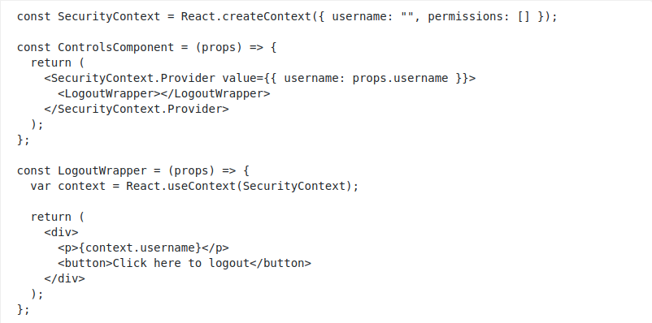

Consider the following components:

Select all the correct statements if ControlsComponent is rendered with the username prop equal to "James".

(Select all acceptable answers.)

1. context.username in the LogoutWrapper will have "James" as its value. +
2. context.permissions in the LogoutWrapper will have [ ] as its value. -
3. If none of the components have a SecurityContext.Provider, the value of context.username in the LogoutWrapper will be "". +
4. If a component that renders ControlsComponent provides another SecurityContext.Provider, the LogoutWrapper will use it instead of the one provided by ControlsComponent. -
5. A single component can declare multiple instances of SecurityContext.Provider. +